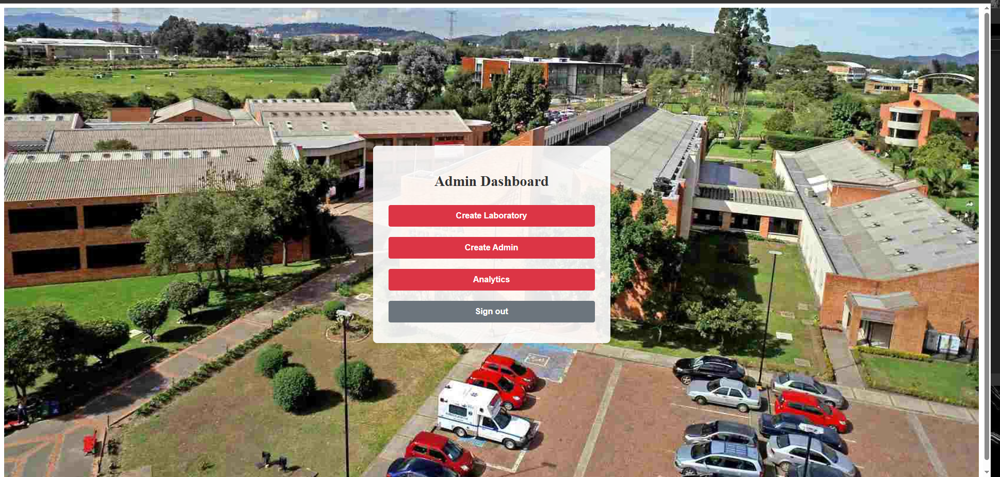
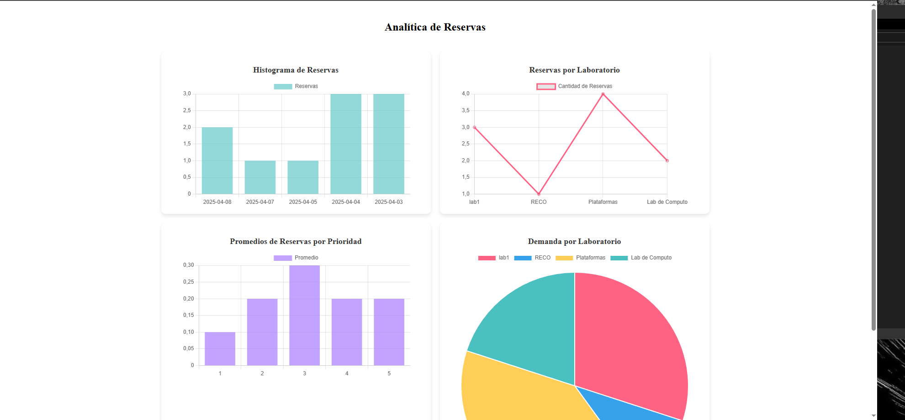
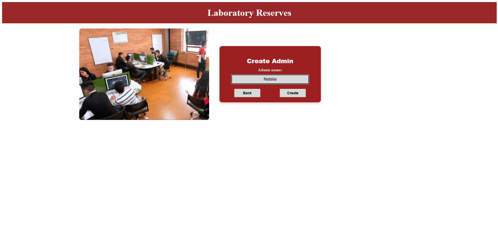
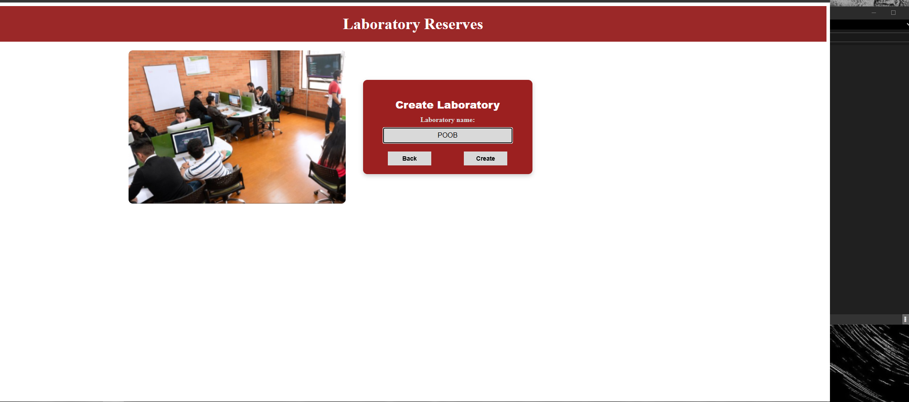
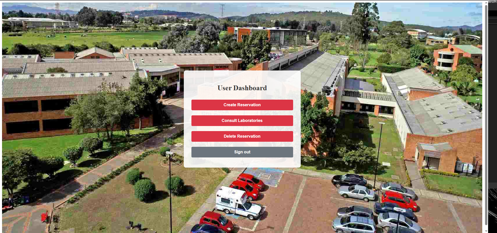
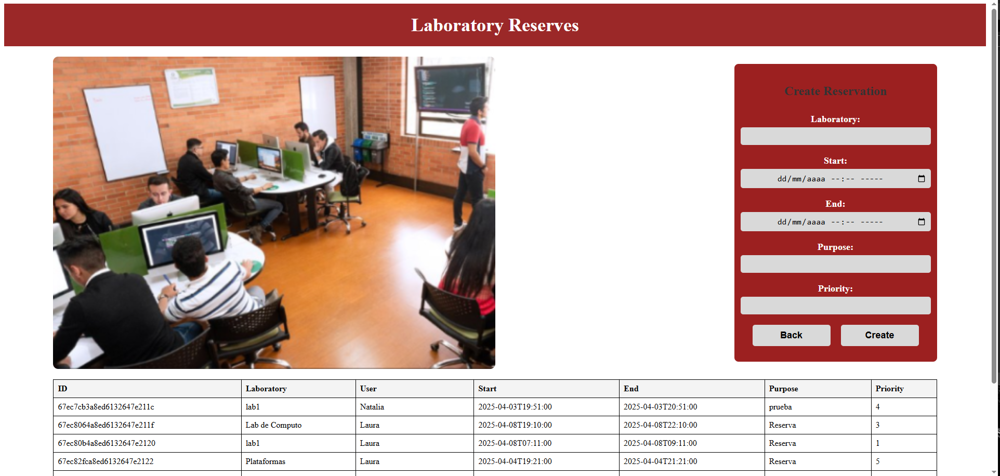
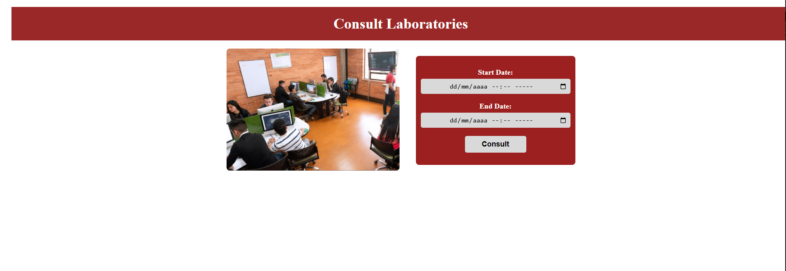
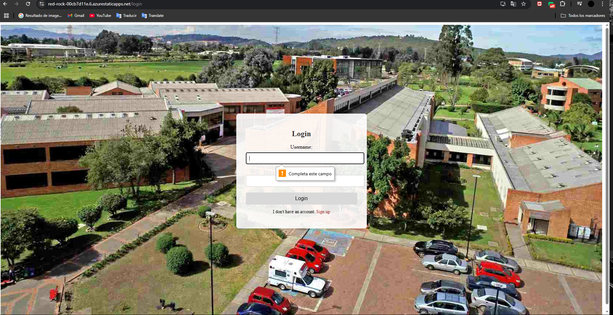

# Proyecto de Gestión de Reservas

## Tecnologías Utilizadas

- **React**: Framework de JavaScript para construir interfaces de usuario interactivas.
- **CSS**: Para el diseño y la apariencia del proyecto.
- **React Router DOM**: Para la navegación entre páginas dentro de la aplicación.
- **GitHub Actions**: Para la integración y despliegue continuo (CI/CD).
- **Azure Static Web Apps**: Para el despliegue de la aplicación en la nube.
- **Fetch**: Para realizar peticiones HTTP

## Estructura del Proyecto

La estructura del proyecto dentro de la carpeta `src` es la siguiente:

```
src/
│── api/
│   ├── analytics.js
│   ├── laboratoryAPI.js
│   ├── login.js
│   ├── reservesAPI.js
│   ├── user.js
│
│── auth/
│   ├── userSession.js
│
│── components/
│   ├── Analytics.jsx
│   ├── ConsultLaboratories.jsx
│   ├── CreateAdmin.jsx
│   ├── CreateLaboratory.jsx
│   ├── CreateReserve.jsx
│   ├── DeleteReserve.jsx
│   ├── LoginForm.jsx
│   ├── navigation.js
│   ├── navigationAdmin.js
│   ├── RegisterForm.jsx
│
│── img/
│
│── pages/
│   ├── AdminDashboard.jsx
│   ├── AnalyticsPage.jsx
│   ├── ConsultLaboratoriesPage.jsx
│   ├── CreateAdminPage.jsx
│   ├── CreateLaboratoryPage.jsx
│   ├── CreateReservePage.jsx
│   ├── DeleteReservePage.jsx
│   ├── LoginPage.jsx
│   ├── RegisterPage.jsx
│   ├── UserDashboard.jsx
│
│── styles/
│   ├── admin_dashboard.css
│   ├── analytics.css
│   ├── consultLaboratories.css
│   ├── createAdmin.css
│   ├── createLaboratory.css
│   ├── createReserve.css
│   ├── deleteReserve.css
│   ├── register.css
│   ├── style.css
│   ├── user_dashboard.css
│
│── App.jsx
│── config.js
│── index.js
│── logo.svg
```

## Configuración de GitHub Actions

El proyecto está configurado para integrarse con GitHub Actions para la automatización del despliegue en **Azure Static Web Apps**. La configuración se encuentra en `.github/workflows/` dentro del repositorio y sigue esta estructura:

```yaml
name: Azure Static Web Apps CI/CD

on:
  push:
    branches:
      - main
      - Development
  pull_request:
    types: [opened, synchronize, reopened, closed]
    branches:
      - Development
      - main

jobs:
  build_and_deploy_job:
    if: github.event_name == 'push' || (github.event_name == 'pull_request' && github.event.action != 'closed')
    runs-on: ubuntu-latest
    name: Build and Deploy Job
    steps:
      - uses: actions/checkout@v3
        with:
          submodules: true
          lfs: false

      - name: Set up Node.js version
        uses: actions/setup-node@v3
        with:
          node-version: '20.x' # Fuerza Node.js 20

      # Paso adicional para configurar CI a false y evitar errores de ESLint
      - name: Set CI to false
        run: echo "CI=false" >> $GITHUB_ENV

      - name: Install Dependencies
        run: |
          npm install

      - name: Build And Deploy
        id: builddeploy
        uses: Azure/static-web-apps-deploy@v1
        with:
          azure_static_web_apps_api_token: ${{ secrets.AZURE_STATIC_WEB_APPS_API_TOKEN_RED_ROCK_00CB7D11E }}
          repo_token: ${{ secrets.GITHUB_TOKEN }} # Used for Github integrations (i.e. PR comments)
          action: "upload"
          ###### Repository/Build Configurations - These values can be configured to match your app requirements. ######
          app_location: "/" # App source code path
          api_location: "" # Api source code path - optional
          output_location: "build" # Built app content directory - optional
          ###### End of Repository/Build Configurations ######

  close_pull_request_job:
    if: github.event_name == 'pull_request' && github.event.action == 'closed'
    runs-on: ubuntu-latest
    name: Close Pull Request Job
    steps:
      - name: Close Pull Request
        id: closepullrequest
        uses: Azure/static-web-apps-deploy@v1
        with:
          azure_static_web_apps_api_token: ${{ secrets.AZURE_STATIC_WEB_APPS_API_TOKEN_RED_ROCK_00CB7D11E }}
          action: "close"
```
## Elección de Chart.js para Visualización de Datos

### Comparación de Bibliotecas de Gráficos en JavaScript

Para la implementación de la página de "Analítica" en nuestra aplicación, hemos evaluado diversas bibliotecas de visualización de datos en JavaScript. Tras analizar las opciones disponibles, hemos decidido utilizar **Chart.js** debido a su facilidad de integración con **React** y su simplicidad en el manejo de datos.

A continuación, se presenta una comparación entre **Chart.js** y otras opciones populares:

| Biblioteca    | Pros | Contras |
|--------------|------|---------|
| **Chart.js** | Fácil de integrar con React (¡ideal para nuestro proyecto!)<br>Documentación clara y extensa<br>Compatible con varios tipos de gráficos<br>Rendimiento optimizado para dashboards pequeños y medianos | Puede ser menos flexible que D3.js para personalizaciones avanzadas<br>No es ideal para conjuntos de datos masivos |
| **D3.js** | Altamente personalizable<br>Manipulación avanzada de SVG y DOM<br>Compatible con visualizaciones interactivas complejas | Curva de aprendizaje alta<br>Requiere más código para lograr lo mismo que en Chart.js<br>Mayor consumo de recursos |
| **C3.js** | Basado en D3.js pero con una API más fácil de usar<br>Soporta interactividad y configuraciones flexibles | Depende de D3.js (puede ser pesado)<br>No tan popular como otras opciones |
| **Google Charts** | Fácil de usar y bien documentado<br>Integrado con Google Data Studio<br>Variedad de gráficos predefinidos | Requiere conexión a internet (menos personalizable)<br>No tan flexible como D3.js o Chart.js |

### Justificación de Chart.js para nuestro Proyecto

1. **Fácil Integración con React**: Chart.js tiene soporte directo con React a través de librerías como `react-chartjs-2`, lo que facilita la implementación de gráficos sin necesidad de manipular directamente el DOM.
2. **Curva de Aprendizaje Baja**: A diferencia de D3.js, Chart.js permite crear gráficos funcionales con menos código, lo que acelera el desarrollo.
3. **Rendimiento y Simplicidad**: Para dashboards de tamaño mediano, Chart.js ofrece un excelente balance entre rendimiento y facilidad de uso.
4. **Interactividad Incluida**: Soporta tooltips, animaciones y eventos sin configuraciones complicadas.
5. **Diseño Moderno**: Los gráficos tienen un aspecto limpio y personalizable sin necesidad de grandes modificaciones.


## Funcionamiento de la pagina 
A continuación, se presentan imágenes que muestran las diferentes secciones de la aplicación, desde la interfaz de usuario hasta la interfaz de administrador.

Interfaz de administrador: Incluye herramientas para visualizar análisis y gestionar funcionalidades como la creación de laboratorios y usuarios.









Interfaz de usuario: Permite consultar los laboratorios disponibles, realizar reservas y acceder a otras funciones.








Proceso de inicio de sesión: Muestra la autenticación y acceso a las distintas secciones de la plataforma.



## Integrantes

* **Santiago Amaya Zapata** - [SantiagoAmaya21](https://github.com/SantiagoAmaya21)
* **Laura Natalia Perilla Quintero** - [Lanapequin](https://github.com/Lanapequin)
* **Juan Miguel Rojas Chaparro** - [juanmiguelrojas](https://github.com/juanmiguelrojas)
* **Cristian David Silva Perilla** - [CRISTIANSILVAP](https://github.com/CRISTIANSILVAP)


